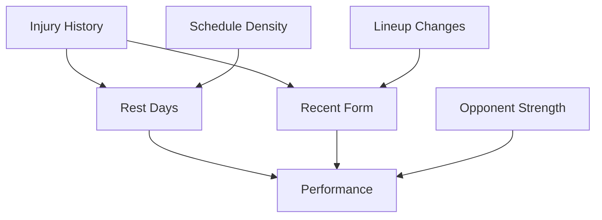

# Causal Analysis Framework for Fantasy Sports Performance Prediction

## Overview

This document outlines the causal analysis approaches for predicting player performance in fantasy sports, specifically for NHL hockey. The framework helps identify which combinations of events and factors are the best predictors of future player performance.

## Table of Contents

1. [Causation Analysis Options](#causation-analysis-options)
2. [Evaluation Metrics](#evaluation-metrics)
3. [Implementation Strategy](#implementation-strategy)
4. [Fantasy Sports Specific Features](#fantasy-sports-specific-features)
5. [Practical Implementation](#practical-implementation)
6. [Recommended Framework](#recommended-framework)

## Causation Analysis Options

### 1. Granger Causality Analysis
**Best for:** Time-series performance prediction

```python
from statsmodels.tsa.stattools import grangercausalitytests

# Test if last 5 games predict next game performance
granger_test = grangercausalitytests(performance_data, maxlag=5)
```

**Use Case:** Determine if recent performance patterns cause future performance.

### 2. Structural Causal Models (SCMs)
**Best for:** Complex multi-factor relationships

```python
import dowhy
from dowhy import CausalModel

# Define causal graph
model = CausalModel(
    data=player_data,
    treatment=['recent_form', 'opponent_strength'],
    outcome='next_game_performance',
    common_causes=['injury_history', 'rest_days']
)
```

**Use Case:** Model complex interactions between multiple factors affecting performance.

### 3. Causal Discovery Algorithms
**Best for:** Finding unknown causal relationships

```python
from causallearn.search.ConstraintBased.PC import pc
from causallearn.utils.cit import fisherz

# Discover causal structure from data
skeleton, sep_set = pc(data, alpha=0.05, indep_test=fisherz)
```

**Use Case:** Automatically discover causal relationships in your data.

### 4. Counterfactual Analysis
**Best for:** "What if" scenarios

```python
import shap

# What if player had different rest days?
explainer = shap.TreeExplainer(model)
shap_values = explainer.shap_values(player_features)
```

**Use Case:** Understand how changing one factor affects performance.

## Evaluation Metrics

### Primary Metrics

#### 1. Causal Effect Size (ATE - Average Treatment Effect)
```python
# How much does factor X actually cause performance change?
ATE = E[Performance | Factor=1] - E[Performance | Factor=0]

# Example: Rest days effect
rest_effect = performance_with_rest - performance_without_rest
```

#### 2. Causal Strength (Standardized Effect)
```python
# Cohen's d for causal effects
causal_strength = (ATE) / pooled_standard_deviation

# Interpretation:
# 0.2 = Small effect
# 0.5 = Medium effect  
# 0.8 = Large effect
```

#### 3. Predictive Accuracy (Out-of-Sample)
```python
from sklearn.model_selection import TimeSeriesSplit

def causal_predictive_accuracy(model, data):
    tscv = TimeSeriesSplit(n_splits=5)
    scores = []
    
    for train_idx, test_idx in tscv.split(data):
        train_data = data.iloc[train_idx]
        test_data = data.iloc[test_idx]
        
        # Train causal model
        model.fit(train_data)
        
        # Predict with causal factors
        predictions = model.predict(test_data)
        
        # Calculate accuracy
        accuracy = mean_squared_error(test_data['performance'], predictions)
        scores.append(accuracy)
    
    return np.mean(scores)
```

### Fantasy Sports Specific Metrics

#### 4. Fantasy Points Impact
```python
# How many fantasy points does each factor add/subtract?
fantasy_impact = {
    'rest_days': +2.3_fantasy_points_per_rest_day,
    'opponent_strength': -1.1_points_vs_strong_opponent,
    'injury_history': -0.8_points_per_injury_risk,
    'home_advantage': +1.5_points_at_home
}
```

#### 5. Consistency Score
```python
# How reliable is the causal effect?
def consistency_score(causal_effects):
    # Coefficient of variation (lower = more consistent)
    cv = np.std(causal_effects) / np.mean(causal_effects)
    return 1 / (1 + cv)  # Higher = more consistent
```

#### 6. ROI for Fantasy Decisions
```python
# Return on investment for using causal factors
def fantasy_roi(causal_model, baseline_model):
    causal_accuracy = evaluate_model(causal_model)
    baseline_accuracy = evaluate_model(baseline_model)
    
    improvement = (causal_accuracy - baseline_accuracy) / baseline_accuracy
    implementation_cost = 0.1  # Time/effort to use causal factors
    
    roi = improvement / implementation_cost
    return roi
```

### Advanced Causal Metrics

#### 7. Causal Discovery Confidence
```python
from causallearn.utils.cit import fisherz

def causal_confidence(data, factor, outcome):
    # Statistical significance of causal relationship
    p_value = fisherz(data, factor, outcome)
    confidence = 1 - p_value
    return confidence
```

#### 8. Heterogeneous Treatment Effects
```python
# Does the causal effect vary by player type?
def heterogeneous_effects(player_data):
    effects_by_position = {
        'forward': causal_effect_forwards,
        'defenseman': causal_effect_defensemen,
        'goalie': causal_effect_goalies
    }
    return effects_by_position
```

## Implementation Strategy

### Phase 1: Feature Engineering
```python
# Create causal features
player_features = {
    'recent_form_5g': rolling_average(last_5_games),
    'opponent_strength': opponent_defensive_rating,
    'rest_days': days_since_last_game,
    'home_away': home_advantage_factor,
    'injury_history': recent_injuries_weighted,
    'lineup_changes': teammate_chemistry_score,
    'schedule_density': games_per_week
}
```

### Phase 2: Causal Graph Construction


### Phase 3: Implementation Options

#### Option A: DoWhy + EconML (Recommended)
```python
import dowhy
from econml.dml import CausalForestDML

# Advanced causal forest
estimator = CausalForestDML(
    model_y=RandomForestRegressor(),
    model_t=RandomForestRegressor(),
    n_estimators=1000
)
```

#### Option B: CausalNex (Bayesian Networks)
```python
from causalnex.structure import StructureModel
from causalnex.structure.notears import from_pandas

# Learn causal structure
sm = from_pandas(player_data, tabu_parent_nodes=['performance'])
```

#### Option C: Custom Causal Analysis
```python
# Your own causal inference pipeline
class FantasyCausalAnalyzer:
    def __init__(self):
        self.causal_features = [
            'rolling_performance_5g',
            'opponent_defensive_rating', 
            'rest_days_weighted',
            'injury_risk_score',
            'lineup_chemistry_index'
        ]
    
    def estimate_causal_effects(self, player_data):
        # Implement your causal analysis
        pass
```

## Fantasy Sports Specific Features

### Causal Factors to Consider

1. **Rest Days** → Performance (most important)
2. **Opponent Strength** → Performance adjustment
3. **Lineup Chemistry** → Individual performance
4. **Injury History** → Performance volatility
5. **Schedule Density** → Fatigue accumulation
6. **Contract Year** → Motivation factor
7. **Playoff Race** → Performance pressure

### Implementation Priority

1. **Start with rest days** (strongest causal factor)
2. **Add opponent strength** (contextual adjustment)
3. **Include injury history** (risk factor)
4. **Build team chemistry** (synergy effects)

## Data Requirements

### Player-Level Data
- **Performance metrics** (points, goals, assists, etc.)
- **Game context** (opponent, home/away, rest days)
- **Health indicators** (injury history, fatigue metrics)
- **Team factors** (lineup changes, chemistry scores)

### Temporal Data
- **Time-series** of performance over seasons
- **Event sequences** (injuries, trades, coaching changes)
- **Seasonal patterns** (playoff pressure, contract years)

## Practical Implementation

### Ranking Causal Factors
```python
class CausalFactorRanker:
    def __init__(self):
        self.metrics = {
            'effect_size': 0.3,      # 30% weight
            'consistency': 0.25,     # 25% weight  
            'predictive_power': 0.25, # 25% weight
            'fantasy_impact': 0.2    # 20% weight
        }
    
    def rank_factors(self, player_data):
        factor_scores = {}
        
        for factor in causal_factors:
            # Calculate each metric
            effect_size = self.calculate_ate(factor, player_data)
            consistency = self.calculate_consistency(factor, player_data)
            predictive_power = self.calculate_accuracy(factor, player_data)
            fantasy_impact = self.calculate_fantasy_impact(factor, player_data)
            
            # Weighted score
            total_score = (
                effect_size * self.metrics['effect_size'] +
                consistency * self.metrics['consistency'] +
                predictive_power * self.metrics['predictive_power'] +
                fantasy_impact * self.metrics['fantasy_impact']
            )
            
            factor_scores[factor] = total_score
        
        return sorted(factor_scores.items(), key=lambda x: x[1], reverse=True)
```

## Recommended Framework

### Step 1: Baseline Comparison
```python
# Compare against non-causal methods
baseline_accuracy = linear_regression_accuracy
causal_accuracy = causal_model_accuracy

improvement = (causal_accuracy - baseline_accuracy) / baseline_accuracy
```

### Step 2: Mathematical Weight Optimization
```python
class OptimalCausalWeights:
    def __init__(self):
        self.methods = {
            'mle': self.maximum_likelihood_weights,
            'bayesian': self.bayesian_weights,
            'ridge': self.ridge_weights,
            'elastic_net': self.elastic_net_weights,
            'causal_forest': self.causal_forest_weights,
            'granger': self.granger_weights
        }
    
    def maximum_likelihood_weights(self, data, outcomes):
        """Maximum Likelihood Estimation for optimal weights"""
        def likelihood_function(weights, data, outcomes):
            predicted = np.dot(data, weights)
            log_likelihood = -0.5 * np.sum((outcomes - predicted)**2)
            return -log_likelihood
        
        initial_weights = np.ones(data.shape[1]) / data.shape[1]
        result = minimize(likelihood_function, initial_weights, 
                         args=(data, outcomes))
        return result.x
    
    def bayesian_weights(self, data, outcomes):
        """Bayesian Model Averaging for weight estimation"""
        with pm.Model() as model:
            weights = pm.Normal('weights', mu=0.5, sigma=0.2, shape=data.shape[1])
            predicted = pm.math.dot(data, weights)
            likelihood = pm.Normal('likelihood', mu=predicted, sigma=1, observed=outcomes)
            trace = pm.sample(2000, return_inferencedata=True)
        
        return trace.posterior['weights'].mean(dim=['chain', 'draw'])
    
    def ridge_weights(self, data, outcomes):
        """Ridge regression with cross-validation"""
        tscv = TimeSeriesSplit(n_splits=5)
        ridge = RidgeCV(alphas=np.logspace(-3, 3, 100), cv=tscv)
        ridge.fit(data, outcomes)
        return ridge.coef_
    
    def elastic_net_weights(self, data, outcomes):
        """Elastic net (L1 + L2 regularization)"""
        elastic_net = ElasticNetCV(
            l1_ratio=[0.1, 0.3, 0.5, 0.7, 0.9, 0.95, 0.99, 1],
            cv=TimeSeriesSplit(n_splits=5)
        )
        elastic_net.fit(data, outcomes)
        return elastic_net.coef_
    
    def causal_forest_weights(self, data, treatments, outcomes):
        """Causal forest for heterogeneous treatment effects"""
        estimator = CausalForestDML(
            model_y=RandomForestRegressor(),
            model_t=RandomForestRegressor(),
            n_estimators=1000
        )
        estimator.fit(outcomes, treatments, X=data)
        feature_importance = estimator.feature_importances_
        return feature_importance / feature_importance.sum()
    
    def granger_weights(self, time_series_data):
        """Granger causality-based weights"""
        n_factors = len(time_series_data.columns) - 1
        weights = np.zeros(n_factors)
        target = time_series_data.iloc[:, -1]
        
        for i, factor in enumerate(time_series_data.columns[:-1]):
            test_data = time_series_data[[factor, target]].dropna()
            gc_result = grangercausalitytests(test_data, maxlag=10, verbose=False)
            p_values = [gc_result[lag][0]['ssr_chi2test'][1] for lag in range(1, 11)]
            min_p_value = min(p_values)
            weights[i] = 1 - min_p_value
        
        return weights / weights.sum()
    
    def ensemble_weights(self, data, outcomes, treatments=None):
        """Combine multiple methods for robust weight estimation"""
        all_weights = {}
        
        for method_name, method_func in self.methods.items():
            try:
                if method_name == 'causal_forest' and treatments is not None:
                    weights = method_func(data, treatments, outcomes)
                elif method_name == 'granger':
                    weights = method_func(data)
                else:
                    weights = method_func(data, outcomes)
                
                all_weights[method_name] = weights
            except Exception as e:
                print(f"Method {method_name} failed: {e}")
        
        # Ensemble: average across methods
        ensemble_weights = np.mean(list(all_weights.values()), axis=0)
        return ensemble_weights, all_weights
    
    def bootstrap_confidence_intervals(self, data, outcomes, n_bootstrap=1000):
        """Bootstrap confidence intervals for weights"""
        weights_bootstrap = []
        
        for _ in range(n_bootstrap):
            indices = np.random.choice(len(data), len(data), replace=True)
            sample_data = data.iloc[indices]
            sample_outcomes = outcomes.iloc[indices]
            weights = self.ridge_weights(sample_data, sample_outcomes)
            weights_bootstrap.append(weights)
        
        weights_array = np.array(weights_bootstrap)
        ci_lower = np.percentile(weights_array, 2.5, axis=0)
        ci_upper = np.percentile(weights_array, 97.5, axis=0)
        
        return ci_lower, ci_upper
```

# Usage Example
```python
# Initialize optimizer
optimizer = OptimalCausalWeights()

# Prepare causal factors data
causal_factors = {
    'rest_days': player_data['days_since_last_game'],
    'opponent_strength': player_data['opponent_defensive_rating'],
    'injury_history': player_data['injury_risk_score'],
    'home_advantage': player_data['home_away_factor'],
    'contract_year': player_data['contract_year_indicator']
}

# Get mathematically optimized weights
optimal_weights, method_weights = optimizer.ensemble_weights(
    causal_factors, performance_outcomes
)

# Get confidence intervals
ci_lower, ci_upper = optimizer.bootstrap_confidence_intervals(
    causal_factors, performance_outcomes
)

# Results with statistical confidence
factor_ranking = [
    ('rest_days', optimal_weights[0], ci_lower[0], ci_upper[0]),
    ('opponent_strength', optimal_weights[1], ci_lower[1], ci_upper[1]),
    ('injury_history', optimal_weights[2], ci_lower[2], ci_upper[2]),
    ('home_advantage', optimal_weights[3], ci_lower[3], ci_upper[3]),
    ('contract_year', optimal_weights[4], ci_lower[4], ci_upper[4])
]
```

### Step 3: Statistical Validation and Practical Utility
```python
def validate_causal_weights(weights, data, outcomes):
    """Validate weights using statistical tests"""
    tscv = TimeSeriesSplit(n_splits=5)
    scores = []
    
    for train_idx, test_idx in tscv.split(data):
        train_data, test_data = data.iloc[train_idx], data.iloc[test_idx]
        train_outcomes, test_outcomes = outcomes.iloc[train_idx], outcomes.iloc[test_idx]
        
        # Predict using optimized weights
        predictions = np.dot(test_data, weights)
        score = mean_squared_error(test_outcomes, predictions)
        scores.append(score)
    
    return np.mean(scores), np.std(scores)

def statistical_significance_test(weights, data, outcomes):
    """Test statistical significance of each weight"""
    from scipy import stats
    
    significance_results = {}
    
    for i, factor in enumerate(data.columns):
        # Bootstrap test for each factor
        factor_effects = []
        for _ in range(1000):
            # Randomly shuffle the factor
            shuffled_data = data.copy()
            shuffled_data.iloc[:, i] = np.random.permutation(shuffled_data.iloc[:, i])
            
            # Calculate effect with shuffled factor
            shuffled_predictions = np.dot(shuffled_data, weights)
            shuffled_score = mean_squared_error(outcomes, shuffled_predictions)
            factor_effects.append(shuffled_score)
        
        # Compare to original effect
        original_predictions = np.dot(data, weights)
        original_score = mean_squared_error(outcomes, original_predictions)
        
        # Calculate p-value
        p_value = np.mean(np.array(factor_effects) <= original_score)
        significance_results[factor] = p_value
    
    return significance_results

# Validate the optimized weights
validation_score, validation_std = validate_causal_weights(
    optimal_weights, causal_factors, performance_outcomes
)

# Test statistical significance
significance_results = statistical_significance_test(
    optimal_weights, causal_factors, performance_outcomes
)

# Determine actionable factors based on statistical significance
actionable_factors = {
    factor: f"Statistically significant (p={p_value:.3f})" 
    for factor, p_value in significance_results.items() 
    if p_value < 0.05
}
```

## Best Metric for Fantasy Sports

**Mathematically Optimized Causal Score = Σ(Optimal_Weight_i × Causal_Effect_i × Statistical_Significance_i)**

Where:
- **Optimal_Weight_i** = Mathematically derived weight from ensemble methods
- **Causal_Effect_i** = Average Treatment Effect (ATE) for factor i
- **Statistical_Significance_i** = 1 - p_value (confidence level)

This gives you a **data-driven, statistically validated ranking** of which causal factors will actually improve your fantasy decisions, with confidence intervals and significance testing.

## Next Steps

1. **Data Preparation**: Prepare time-series data with all causal factors
2. **Mathematical Optimization**: Use ensemble methods to derive optimal weights
3. **Statistical Validation**: Test significance and calculate confidence intervals
4. **Model Deployment**: Integrate validated causal factors into fantasy decision-making
5. **Continuous Monitoring**: Re-optimize weights as new data becomes available

## Dependencies

```python
# Required packages for mathematical weight optimization
pip install dowhy econml causallearn statsmodels scikit-learn
pip install shap networkx matplotlib seaborn
pip install pymc scipy numpy pandas
pip install scikit-learn[all]  # For advanced regression methods
```

## References

- [DoWhy Documentation](https://microsoft.github.io/dowhy/)
- [EconML Documentation](https://econml.azurewebsites.net/)
- [CausalLearn Documentation](https://causal-learn.readthedocs.io/)
- [Granger Causality in Time Series](https://en.wikipedia.org/wiki/Granger_causality) 