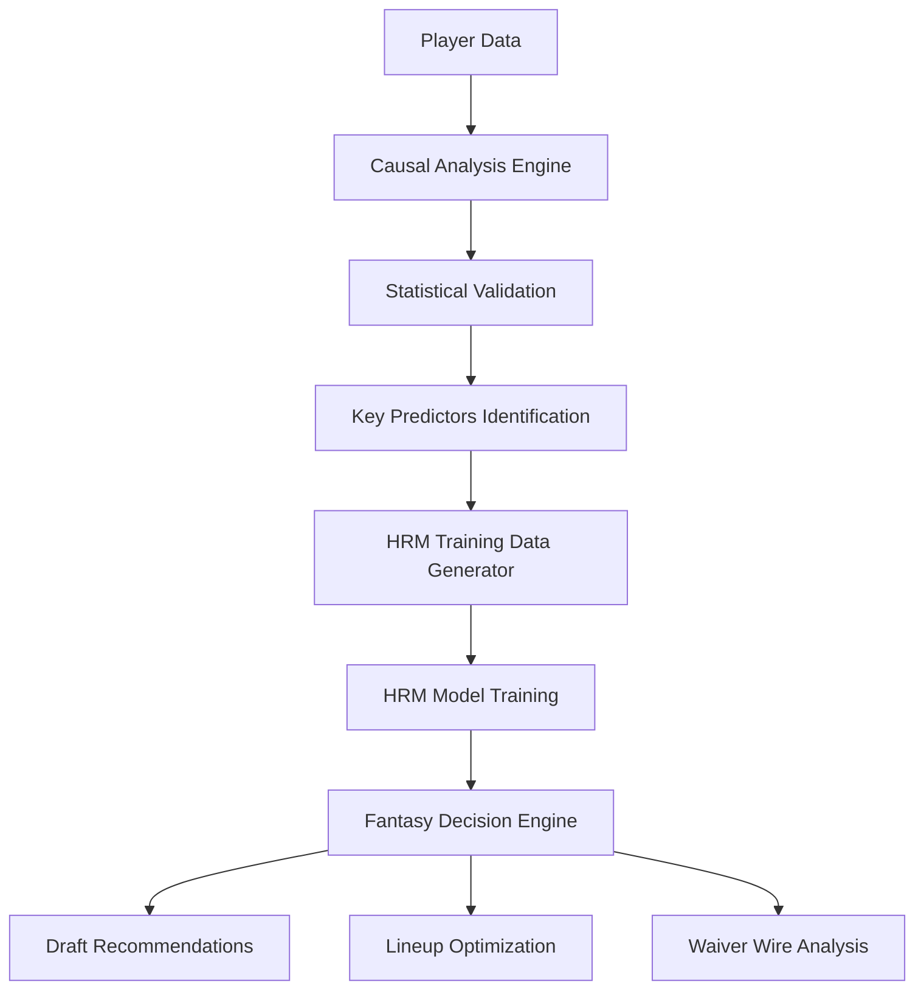
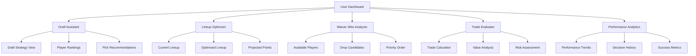

# Fantasy Sports AI: Causal Analysis + HRM Architecture

## Overview

This document outlines the comprehensive plan for building an AI system that excels at fantasy sports decision-making by combining mathematical causal analysis with the Hierarchical Reasoning Model (HRM). The system will help users draft players, set lineups, and make waiver wire decisions through real-time, data-driven reasoning.

## Table of Contents

1. [System Architecture](#system-architecture)
2. [Phase 1: Causal Analysis Foundation](#phase-1-causal-analysis-foundation)
3. [Phase 2: HRM Integration](#phase-2-hrm-integration)
4. [Phase 3: Deployment & Optimization](#phase-3-deployment--optimization)
5. [Technical Implementation](#technical-implementation)
6. [Evaluation & Validation](#evaluation--validation)
7. [Future Enhancements](#future-enhancements)

## System Architecture

### High-Level Design



### Core Components

#### 1. Causal Analysis Foundation
- **Mathematical weight optimization** using ensemble methods
- **Statistical validation** with confidence intervals
- **Significance testing** for factor selection
- **Time-series analysis** for performance prediction

#### 2. HRM Integration Layer
- **Hierarchical reasoning** for strategic planning
- **Real-time decision making** with single forward pass
- **Pattern recognition** for complex player relationships
- **Efficient training** with limited data requirements

#### 3. Fantasy Decision Engine
- **Draft strategy optimization**
- **Lineup management**
- **Waiver wire evaluation**
- **Trade analysis**

## Phase 1: Causal Analysis Foundation

### 1.1 Data Preparation

```python
class FantasyDataPreprocessor:
    def __init__(self):
        self.causal_factors = [
            'rest_days',
            'opponent_strength', 
            'injury_history',
            'home_advantage',
            'contract_year',
            'schedule_density',
            'lineup_chemistry',
            'playoff_race_pressure'
        ]
    
    def prepare_player_data(self, raw_data):
        """Prepare player data for causal analysis"""
        processed_data = {}
        
        for player in raw_data:
            processed_player = {
                'player_id': player['id'],
                'recent_performance': self.calculate_recent_performance(player),
                'causal_factors': self.extract_causal_factors(player),
                'game_context': self.extract_game_context(player),
                'fantasy_points': player['fantasy_points']
            }
            processed_data[player['id']] = processed_player
        
        return processed_data
    
    def calculate_recent_performance(self, player):
        """Calculate rolling performance metrics"""
        return {
            'last_5_games_avg': np.mean(player['recent_games'][-5:]),
            'last_10_games_avg': np.mean(player['recent_games'][-10:]),
            'performance_trend': self.calculate_trend(player['recent_games']),
            'consistency_score': self.calculate_consistency(player['recent_games'])
        }
    
    def extract_causal_factors(self, player):
        """Extract causal factors for analysis"""
        return {
            'rest_days': player['days_since_last_game'],
            'opponent_strength': player['opponent_defensive_rating'],
            'injury_history': self.calculate_injury_risk(player),
            'home_advantage': 1 if player['is_home'] else 0,
            'contract_year': 1 if player['is_contract_year'] else 0,
            'schedule_density': player['games_per_week'],
            'lineup_chemistry': self.calculate_chemistry_score(player),
            'playoff_race_pressure': self.calculate_playoff_pressure(player)
        }
```

### 1.2 Causal Weight Optimization

```python
class CausalWeightOptimizer:
    def __init__(self):
        self.optimization_methods = {
            'mle': self.maximum_likelihood_weights,
            'bayesian': self.bayesian_weights,
            'ridge': self.ridge_weights,
            'elastic_net': self.elastic_net_weights,
            'causal_forest': self.causal_forest_weights,
            'granger': self.granger_weights
        }
    
    def optimize_weights(self, player_data, performance_outcomes):
        """Optimize causal weights using ensemble methods"""
        # Prepare data for optimization
        causal_factors_matrix = self.prepare_factor_matrix(player_data)
        
        # Run ensemble optimization
        optimal_weights, method_weights = self.ensemble_weights(
            causal_factors_matrix, performance_outcomes
        )
        
        # Calculate confidence intervals
        ci_lower, ci_upper = self.bootstrap_confidence_intervals(
            causal_factors_matrix, performance_outcomes
        )
        
        return {
            'optimal_weights': optimal_weights,
            'method_weights': method_weights,
            'confidence_intervals': {'lower': ci_lower, 'upper': ci_upper}
        }
    
    def validate_significance(self, weights, data, outcomes):
        """Test statistical significance of each weight"""
        significance_results = {}
        
        for i, factor in enumerate(data.columns):
            p_value = self.permutation_test(data, outcomes, weights, i)
            significance_results[factor] = p_value
        
        return significance_results
```

### 1.3 Statistical Validation

```python
class StatisticalValidator:
    def __init__(self):
        self.validation_methods = [
            'time_series_cv',
            'bootstrap_validation',
            'permutation_testing',
            'out_of_sample_testing'
        ]
    
    def comprehensive_validation(self, weights, data, outcomes):
        """Comprehensive statistical validation"""
        validation_results = {}
        
        # Time-series cross-validation
        validation_results['ts_cv'] = self.time_series_cv(weights, data, outcomes)
        
        # Bootstrap validation
        validation_results['bootstrap'] = self.bootstrap_validation(weights, data, outcomes)
        
        # Permutation testing
        validation_results['permutation'] = self.permutation_testing(weights, data, outcomes)
        
        # Out-of-sample testing
        validation_results['oos'] = self.out_of_sample_testing(weights, data, outcomes)
        
        return validation_results
    
    def time_series_cv(self, weights, data, outcomes):
        """Time-series cross-validation"""
        tscv = TimeSeriesSplit(n_splits=5)
        scores = []
        
        for train_idx, test_idx in tscv.split(data):
            train_data, test_data = data.iloc[train_idx], data.iloc[test_idx]
            train_outcomes, test_outcomes = outcomes.iloc[train_idx], outcomes.iloc[test_idx]
            
            # Predict using weights
            predictions = np.dot(test_data, weights)
            score = mean_squared_error(test_outcomes, predictions)
            scores.append(score)
        
        return {
            'mean_score': np.mean(scores),
            'std_score': np.std(scores),
            'scores': scores
        }
```

## Phase 2: HRM Integration

### 2.1 Training Data Generation

```python
class HRMTrainingDataGenerator:
    def __init__(self, causal_insights):
        self.causal_weights = causal_insights['optimal_weights']
        self.significant_factors = causal_insights['significant_factors']
        self.confidence_intervals = causal_insights['confidence_intervals']
    
    def generate_fantasy_scenarios(self, player_data):
        """Generate training scenarios for HRM"""
        scenarios = []
        
        for player in player_data:
            # Create draft decision scenario
            draft_scenario = self.create_draft_scenario(player)
            scenarios.append(draft_scenario)
            
            # Create lineup decision scenario
            lineup_scenario = self.create_lineup_scenario(player)
            scenarios.append(lineup_scenario)
            
            # Create waiver wire scenario
            waiver_scenario = self.create_waiver_scenario(player)
            scenarios.append(waiver_scenario)
        
        return scenarios
    
    def create_draft_scenario(self, player):
        """Create draft decision training scenario"""
        return {
            'input': {
                'player_stats': player['recent_performance'],
                'causal_factors': self.extract_causal_factors(player),
                'draft_context': {
                    'round': player['draft_round'],
                    'position_needs': player['position_needs'],
                    'available_players': player['available_alternatives']
                }
            },
            'output': {
                'draft_decision': self.generate_draft_decision(player),
                'confidence': self.calculate_decision_confidence(player),
                'reasoning': self.generate_draft_reasoning(player)
            }
        }
    
    def create_lineup_scenario(self, player):
        """Create lineup decision training scenario"""
        return {
            'input': {
                'player_stats': player['recent_performance'],
                'causal_factors': self.extract_causal_factors(player),
                'lineup_context': {
                    'current_lineup': player['current_lineup'],
                    'bench_players': player['bench_players'],
                    'opponent_matchup': player['opponent_analysis']
                }
            },
            'output': {
                'lineup_decision': self.generate_lineup_decision(player),
                'confidence': self.calculate_decision_confidence(player),
                'reasoning': self.generate_lineup_reasoning(player)
            }
        }
    
    def create_waiver_scenario(self, player):
        """Create waiver wire decision training scenario"""
        return {
            'input': {
                'player_stats': player['recent_performance'],
                'causal_factors': self.extract_causal_factors(player),
                'waiver_context': {
                    'waiver_priority': player['waiver_priority'],
                    'available_players': player['waiver_players'],
                    'roster_spots': player['available_roster_spots']
                }
            },
            'output': {
                'waiver_decision': self.generate_waiver_decision(player),
                'confidence': self.calculate_decision_confidence(player),
                'reasoning': self.generate_waiver_reasoning(player)
            }
        }
    
    def extract_causal_factors(self, player):
        """Extract only statistically significant causal factors"""
        significant_factors = {}
        for factor in self.significant_factors:
            if factor in player['causal_factors']:
                # Apply causal weight
                weight = self.causal_weights[factor]
                significant_factors[factor] = player['causal_factors'][factor] * weight
        
        return significant_factors
```

### 2.2 HRM Model Training

```python
class FantasySportsHRM:
    def __init__(self):
        self.hrm_model = HRMModel()
        self.causal_insights = None
        self.training_scenarios = None
    
    def train_with_causal_insights(self, player_data, causal_insights):
        """Train HRM using causal analysis insights"""
        self.causal_insights = causal_insights
        
        # Generate training data
        data_generator = HRMTrainingDataGenerator(causal_insights)
        self.training_scenarios = data_generator.generate_fantasy_scenarios(player_data)
        
        # Train HRM model
        training_config = {
            'epochs': 20000,
            'eval_interval': 2000,
            'learning_rate': 7e-5,
            'weight_decay': 1.0,
            'batch_size': 384
        }
        
        self.hrm_model.train(
            scenarios=self.training_scenarios,
            config=training_config
        )
        
        return self.hrm_model
    
    def make_fantasy_decisions(self, player_data):
        """Use trained HRM for fantasy decisions"""
        decisions = {}
        
        # High-level strategic planning
        draft_strategy = self.hrm_model.plan_draft_strategy(player_data)
        
        # Low-level specific decisions
        decisions['draft_picks'] = self.hrm_model.select_draft_picks(
            player_data, draft_strategy
        )
        decisions['lineup'] = self.hrm_model.optimize_lineup(player_data)
        decisions['waiver_pickups'] = self.hrm_model.evaluate_waiver_players(player_data)
        decisions['trade_analysis'] = self.hrm_model.analyze_trade_offers(player_data)
        
        return decisions
```

### 2.3 HRM Architecture for Fantasy Sports

```python
class FantasySportsHRMArchitecture:
    def __init__(self):
        # High-level module: Strategic planning
        self.high_level_module = {
            'draft_strategy': DraftStrategyPlanner(),
            'season_planning': SeasonPlanningModule(),
            'roster_optimization': RosterOptimizationModule(),
            'risk_management': RiskManagementModule()
        }
        
        # Low-level module: Specific decisions
        self.low_level_module = {
            'player_evaluation': PlayerEvaluationModule(),
            'matchup_analysis': MatchupAnalysisModule(),
            'lineup_optimization': LineupOptimizationModule(),
            'waiver_evaluation': WaiverEvaluationModule()
        }
    
    def hierarchical_reasoning(self, player_data, decision_type):
        """Execute hierarchical reasoning for fantasy decisions"""
        if decision_type == 'draft':
            return self.draft_hierarchical_reasoning(player_data)
        elif decision_type == 'lineup':
            return self.lineup_hierarchical_reasoning(player_data)
        elif decision_type == 'waiver':
            return self.waiver_hierarchical_reasoning(player_data)
        else:
            raise ValueError(f"Unknown decision type: {decision_type}")
    
    def draft_hierarchical_reasoning(self, player_data):
        """Hierarchical reasoning for draft decisions"""
        # High-level: Strategic planning
        draft_strategy = self.high_level_module['draft_strategy'].plan(
            available_players=player_data,
            team_needs=self.analyze_team_needs(),
            draft_position=self.get_draft_position()
        )
        
        # Low-level: Specific player selection
        draft_picks = self.low_level_module['player_evaluation'].evaluate_players(
            players=player_data,
            strategy=draft_strategy
        )
        
        return {
            'strategy': draft_strategy,
            'picks': draft_picks,
            'reasoning': self.generate_draft_reasoning(draft_strategy, draft_picks)
        }
    
    def lineup_hierarchical_reasoning(self, player_data):
        """Hierarchical reasoning for lineup decisions"""
        # High-level: Roster optimization
        roster_strategy = self.high_level_module['roster_optimization'].optimize(
            current_roster=player_data['current_roster'],
            available_players=player_data['available_players'],
            opponent_analysis=player_data['opponent_analysis']
        )
        
        # Low-level: Specific lineup decisions
        optimal_lineup = self.low_level_module['lineup_optimization'].optimize(
            players=player_data['roster_players'],
            strategy=roster_strategy,
            constraints=player_data['lineup_constraints']
        )
        
        return {
            'strategy': roster_strategy,
            'lineup': optimal_lineup,
            'reasoning': self.generate_lineup_reasoning(roster_strategy, optimal_lineup)
        }
```

## Phase 3: Deployment & Optimization

### 3.1 Real-Time Decision Engine

```python
class FantasyDecisionEngine:
    def __init__(self, hrm_model, causal_insights):
        self.hrm_model = hrm_model
        self.causal_insights = causal_insights
        self.decision_cache = {}
    
    def make_draft_recommendation(self, available_players, draft_context):
        """Real-time draft recommendations"""
        # Apply causal insights to player evaluation
        weighted_players = self.apply_causal_weights(available_players)
        
        # Use HRM for hierarchical reasoning
        recommendation = self.hrm_model.draft_hierarchical_reasoning({
            'players': weighted_players,
            'context': draft_context
        })
        
        return {
            'recommended_player': recommendation['picks'][0],
            'confidence': recommendation['confidence'],
            'reasoning': recommendation['reasoning'],
            'alternatives': recommendation['picks'][1:4]
        }
    
    def optimize_lineup(self, current_roster, opponent_analysis):
        """Real-time lineup optimization"""
        # Apply causal insights
        weighted_roster = self.apply_causal_weights(current_roster)
        
        # Use HRM for lineup optimization
        optimization = self.hrm_model.lineup_hierarchical_reasoning({
            'roster': weighted_roster,
            'opponent': opponent_analysis
        })
        
        return {
            'optimal_lineup': optimization['lineup'],
            'projected_points': optimization['projected_points'],
            'confidence': optimization['confidence'],
            'reasoning': optimization['reasoning']
        }
    
    def evaluate_waiver_players(self, waiver_players, current_roster):
        """Real-time waiver wire evaluation"""
        # Apply causal insights
        weighted_waiver = self.apply_causal_weights(waiver_players)
        
        # Use HRM for waiver evaluation
        evaluation = self.hrm_model.waiver_hierarchical_reasoning({
            'waiver_players': weighted_waiver,
            'current_roster': current_roster
        })
        
        return {
            'top_pickups': evaluation['recommendations'],
            'drop_candidates': evaluation['drop_candidates'],
            'priority_order': evaluation['priority_order'],
            'reasoning': evaluation['reasoning']
        }
    
    def apply_causal_weights(self, players):
        """Apply causal weights to player data"""
        weighted_players = []
        
        for player in players:
            weighted_player = player.copy()
            
            # Apply causal weights to relevant factors
            for factor, weight in self.causal_insights['optimal_weights'].items():
                if factor in player:
                    weighted_player[f'weighted_{factor}'] = player[factor] * weight
            
            weighted_players.append(weighted_player)
        
        return weighted_players
```

### 3.2 Performance Monitoring

```python
class PerformanceMonitor:
    def __init__(self):
        self.metrics = {
            'draft_accuracy': [],
            'lineup_performance': [],
            'waiver_success': [],
            'overall_roster_value': []
        }
    
    def track_draft_performance(self, recommendations, actual_performance):
        """Track draft recommendation accuracy"""
        accuracy = self.calculate_draft_accuracy(recommendations, actual_performance)
        self.metrics['draft_accuracy'].append(accuracy)
        
        return accuracy
    
    def track_lineup_performance(self, optimized_lineup, actual_points):
        """Track lineup optimization performance"""
        performance = self.calculate_lineup_performance(optimized_lineup, actual_points)
        self.metrics['lineup_performance'].append(performance)
        
        return performance
    
    def track_waiver_performance(self, waiver_picks, actual_performance):
        """Track waiver wire pick performance"""
        success_rate = self.calculate_waiver_success(waiver_picks, actual_performance)
        self.metrics['waiver_success'].append(success_rate)
        
        return success_rate
    
    def generate_performance_report(self):
        """Generate comprehensive performance report"""
        return {
            'draft_accuracy': {
                'mean': np.mean(self.metrics['draft_accuracy']),
                'trend': self.calculate_trend(self.metrics['draft_accuracy'])
            },
            'lineup_performance': {
                'mean': np.mean(self.metrics['lineup_performance']),
                'trend': self.calculate_trend(self.metrics['lineup_performance'])
            },
            'waiver_success': {
                'mean': np.mean(self.metrics['waiver_success']),
                'trend': self.calculate_trend(self.metrics['waiver_success'])
            },
            'overall_roster_value': {
                'mean': np.mean(self.metrics['overall_roster_value']),
                'trend': self.calculate_trend(self.metrics['overall_roster_value'])
            }
        }
```

## User Interface & Experience Design

### 4.1 UI/UX Architecture



### 4.2 Core UI Components

#### Dashboard Design
```typescript
interface DashboardProps {
  user: User;
  league: League;
  currentWeek: number;
  aiInsights: AIInsights;
}

const Dashboard: React.FC<DashboardProps> = ({ user, league, aiInsights }) => {
  return (
    <div className="dashboard-container">
      {/* Header with user info and league status */}
      <DashboardHeader user={user} league={league} />
      
      {/* Quick actions panel */}
      <QuickActionsPanel aiInsights={aiInsights} />
      
      {/* Main content area */}
      <div className="dashboard-content">
        <div className="left-panel">
          <CurrentRosterWidget />
          <UpcomingMatchupsWidget />
          <AIRecommendationsWidget />
        </div>
        
        <div className="center-panel">
          <PerformanceChart />
          <RecentDecisionsWidget />
          <LeagueStandingsWidget />
        </div>
        
        <div className="right-panel">
          <WaiverWireWidget />
          <TradeOpportunitiesWidget />
          <InjuryReportWidget />
        </div>
      </div>
    </div>
  );
};
```

#### Draft Assistant Interface
```typescript
interface DraftAssistantProps {
  availablePlayers: Player[];
  draftPosition: number;
  teamNeeds: PositionNeeds;
  aiRecommendations: DraftRecommendation[];
}

const DraftAssistant: React.FC<DraftAssistantProps> = ({
  availablePlayers,
  draftPosition,
  teamNeeds,
  aiRecommendations
}) => {
  return (
    <div className="draft-assistant">
      {/* Draft strategy overview */}
      <DraftStrategyPanel 
        teamNeeds={teamNeeds}
        aiStrategy={aiRecommendations.strategy}
      />
      
      {/* Player rankings with AI insights */}
      <PlayerRankingsTable 
        players={availablePlayers}
        aiInsights={aiRecommendations.playerInsights}
        showCausalFactors={true}
      />
      
      {/* Pick recommendations */}
      <PickRecommendationsPanel 
        recommendations={aiRecommendations.topPicks}
        reasoning={aiRecommendations.reasoning}
        confidence={aiRecommendations.confidence}
      />
      
      {/* Draft board visualization */}
      <DraftBoard 
        currentPick={draftPosition}
        selectedPlayers={aiRecommendations.selectedPlayers}
        projectedPicks={aiRecommendations.projectedPicks}
      />
    </div>
  );
};
```

#### Lineup Optimizer Interface
```typescript
interface LineupOptimizerProps {
  currentRoster: Player[];
  opponentAnalysis: OpponentAnalysis;
  aiOptimization: LineupOptimization;
}

const LineupOptimizer: React.FC<LineupOptimizerProps> = ({
  currentRoster,
  opponentAnalysis,
  aiOptimization
}) => {
  return (
    <div className="lineup-optimizer">
      {/* Current vs optimized lineup comparison */}
      <LineupComparisonPanel 
        currentLineup={currentRoster}
        optimizedLineup={aiOptimization.optimalLineup}
        projectedPoints={aiOptimization.projectedPoints}
        confidence={aiOptimization.confidence}
      />
      
      {/* Player-by-player analysis */}
      <PlayerAnalysisGrid 
        players={currentRoster}
        aiInsights={aiOptimization.playerInsights}
        causalFactors={aiOptimization.causalFactors}
      />
      
      {/* Optimization reasoning */}
      <OptimizationReasoningPanel 
        reasoning={aiOptimization.reasoning}
        keyFactors={aiOptimization.keyFactors}
        riskAssessment={aiOptimization.riskAssessment}
      />
      
      {/* One-click optimization */}
      <OptimizationActions 
        onOptimize={handleOptimize}
        onApplyChanges={handleApplyChanges}
        onReset={handleReset}
      />
    </div>
  );
};
```

#### Waiver Wire Analyzer Interface
```typescript
interface WaiverWireAnalyzerProps {
  availablePlayers: Player[];
  currentRoster: Player[];
  waiverPriority: number;
  aiAnalysis: WaiverAnalysis;
}

const WaiverWireAnalyzer: React.FC<WaiverWireAnalyzerProps> = ({
  availablePlayers,
  currentRoster,
  waiverPriority,
  aiAnalysis
}) => {
  return (
    <div className="waiver-wire-analyzer">
      {/* Top pickup recommendations */}
      <PickupRecommendationsPanel 
        recommendations={aiAnalysis.topPickups}
        reasoning={aiAnalysis.pickupReasoning}
        confidence={aiAnalysis.confidence}
      />
      
      {/* Drop candidate analysis */}
      <DropCandidatesPanel 
        candidates={aiAnalysis.dropCandidates}
        reasoning={aiAnalysis.dropReasoning}
        riskAssessment={aiAnalysis.dropRisk}
      />
      
      {/* Priority order with AI insights */}
      <PriorityOrderPanel 
        priorityOrder={aiAnalysis.priorityOrder}
        aiReasoning={aiAnalysis.priorityReasoning}
        waiverPriority={waiverPriority}
      />
      
      {/* Player comparison tool */}
      <PlayerComparisonTool 
        players={availablePlayers}
        comparisonMetrics={aiAnalysis.comparisonMetrics}
        causalFactors={aiAnalysis.causalFactors}
      />
    </div>
  );
};
```

### 4.3 AI Insights Visualization

#### Causal Factor Display
```typescript
interface CausalFactorsWidgetProps {
  player: Player;
  causalFactors: CausalFactor[];
  weights: number[];
  confidence: number;
}

const CausalFactorsWidget: React.FC<CausalFactorsWidgetProps> = ({
  player,
  causalFactors,
  weights,
  confidence
}) => {
  return (
    <div className="causal-factors-widget">
      <h3>AI Analysis: {player.name}</h3>
      
      {/* Factor importance visualization */}
      <div className="factors-chart">
        {causalFactors.map((factor, index) => (
          <FactorBar 
            key={factor.name}
            factor={factor}
            weight={weights[index]}
            impact={factor.impact}
            confidence={factor.confidence}
          />
        ))}
      </div>
      
      {/* Overall confidence indicator */}
      <ConfidenceIndicator 
        confidence={confidence}
        reasoning={player.aiReasoning}
      />
      
      {/* Actionable insights */}
      <ActionableInsights 
        insights={player.actionableInsights}
        recommendations={player.recommendations}
      />
    </div>
  );
};
```

#### Performance Prediction Charts
```typescript
interface PerformancePredictionProps {
  player: Player;
  historicalData: PerformanceData[];
  predictions: PredictionData[];
  confidence: number;
}

const PerformancePrediction: React.FC<PerformancePredictionProps> = ({
  player,
  historicalData,
  predictions,
  confidence
}) => {
  return (
    <div className="performance-prediction">
      {/* Historical performance trend */}
      <PerformanceTrendChart 
        data={historicalData}
        predictions={predictions}
        confidence={confidence}
      />
      
      {/* Causal factor breakdown */}
      <CausalFactorBreakdown 
        factors={player.causalFactors}
        impact={player.factorImpact}
      />
      
      {/* Risk assessment */}
      <RiskAssessmentPanel 
        riskFactors={player.riskFactors}
        riskLevel={player.riskLevel}
        mitigation={player.riskMitigation}
      />
      
      {/* Projected performance */}
      <ProjectedPerformance 
        projection={predictions.projection}
        range={predictions.confidenceInterval}
        scenarios={predictions.scenarios}
      />
    </div>
  );
};
```

### 4.4 Interactive Features

#### Real-Time Decision Support
```typescript
interface DecisionSupportProps {
  decision: Decision;
  aiInsights: AIInsights;
  alternatives: Alternative[];
}

const DecisionSupport: React.FC<DecisionSupportProps> = ({
  decision,
  aiInsights,
  alternatives
}) => {
  return (
    <div className="decision-support">
      {/* AI recommendation */}
      <AIRecommendation 
        recommendation={aiInsights.recommendation}
        confidence={aiInsights.confidence}
        reasoning={aiInsights.reasoning}
      />
      
      {/* Alternative options */}
      <AlternativeOptions 
        alternatives={alternatives}
        comparison={aiInsights.comparison}
      />
      
      {/* Decision impact analysis */}
      <DecisionImpact 
        impact={aiInsights.impact}
        risks={aiInsights.risks}
        benefits={aiInsights.benefits}
      />
      
      {/* One-click actions */}
      <DecisionActions 
        onAccept={handleAccept}
        onModify={handleModify}
        onReject={handleReject}
      />
    </div>
  );
};
```

#### Explainable AI Interface
```typescript
interface ExplainableAIProps {
  decision: Decision;
  reasoning: AIReasoning;
  causalFactors: CausalFactor[];
}

const ExplainableAI: React.FC<ExplainableAIProps> = ({
  decision,
  reasoning,
  causalFactors
}) => {
  return (
    <div className="explainable-ai">
      {/* Decision explanation */}
      <DecisionExplanation 
        decision={decision}
        reasoning={reasoning}
        factors={causalFactors}
      />
      
      {/* Causal factor visualization */}
      <CausalFactorVisualization 
        factors={causalFactors}
        weights={reasoning.weights}
        interactions={reasoning.interactions}
      />
      
      {/* Confidence breakdown */}
      <ConfidenceBreakdown 
        confidence={reasoning.confidence}
        sources={reasoning.confidenceSources}
        uncertainty={reasoning.uncertainty}
      />
      
      {/* Alternative scenarios */}
      <AlternativeScenarios 
        scenarios={reasoning.scenarios}
        probabilities={reasoning.probabilities}
      />
    </div>
  );
};
```

### 4.5 Mobile-First Design

#### Responsive Layout
```typescript
interface ResponsiveLayoutProps {
  children: React.ReactNode;
  breakpoint: 'mobile' | 'tablet' | 'desktop';
}

const ResponsiveLayout: React.FC<ResponsiveLayoutProps> = ({
  children,
  breakpoint
}) => {
  return (
    <div className={`layout layout-${breakpoint}`}>
      {/* Mobile-optimized navigation */}
      <MobileNavigation 
        sections={['Dashboard', 'Draft', 'Lineup', 'Waiver', 'Trades']}
        activeSection={activeSection}
      />
      
      {/* Adaptive content layout */}
      <AdaptiveContentLayout 
        breakpoint={breakpoint}
        content={children}
      />
      
      {/* Touch-friendly interactions */}
      <TouchOptimizedInteractions 
        gestures={['swipe', 'tap', 'long-press']}
        feedback={true}
      />
    </div>
  );
};
```

### 4.6 User Experience Features

#### Onboarding Flow
```typescript
interface OnboardingFlowProps {
  user: User;
  league: League;
  onComplete: () => void;
}

const OnboardingFlow: React.FC<OnboardingFlowProps> = ({
  user,
  league,
  onComplete
}) => {
  const steps = [
    {
      title: 'Welcome to Fantasy AI',
      content: <WelcomeStep user={user} />,
      action: 'Get Started'
    },
    {
      title: 'Connect Your League',
      content: <LeagueConnectionStep league={league} />,
      action: 'Connect'
    },
    {
      title: 'AI Preferences',
      content: <AIPreferencesStep />,
      action: 'Continue'
    },
    {
      title: 'Quick Tutorial',
      content: <TutorialStep />,
      action: 'Start Using AI'
    }
  ];

  return (
    <OnboardingWizard 
      steps={steps}
      onComplete={onComplete}
      progress={progress}
    />
  );
};
```

#### Personalization Settings
```typescript
interface PersonalizationSettingsProps {
  user: User;
  preferences: UserPreferences;
  onUpdate: (preferences: UserPreferences) => void;
}

const PersonalizationSettings: React.FC<PersonalizationSettingsProps> = ({
  user,
  preferences,
  onUpdate
}) => {
  return (
    <div className="personalization-settings">
      {/* Risk tolerance */}
      <RiskToleranceSlider 
        value={preferences.riskTolerance}
        onChange={(value) => onUpdate({ ...preferences, riskTolerance: value })}
      />
      
      {/* Strategy preferences */}
      <StrategyPreferences 
        strategies={preferences.strategies}
        onChange={(strategies) => onUpdate({ ...preferences, strategies })}
      />
      
      {/* Notification preferences */}
      <NotificationPreferences 
        notifications={preferences.notifications}
        onChange={(notifications) => onUpdate({ ...preferences, notifications })}
      />
      
      {/* AI interaction style */}
      <AIInteractionStyle 
        style={preferences.aiStyle}
        onChange={(style) => onUpdate({ ...preferences, aiStyle: style })}
      />
    </div>
  );
};
```

## Technical Implementation

### 4.7 System Requirements

```python
# Required packages for the complete system
REQUIRED_PACKAGES = {
    'causal_analysis': [
        'dowhy',
        'econml', 
        'causallearn',
        'statsmodels',
        'scikit-learn',
        'scipy',
        'numpy',
        'pandas'
    ],
    'hrm_integration': [
        'torch',
        'transformers',
        'flash-attention',  # For HRM efficiency
        'wandb'  # For experiment tracking
    ],
    'fantasy_sports': [
        'requests',  # For API calls
        'beautifulsoup4',  # For web scraping
        'selenium'  # For dynamic content
    ],
    'deployment': [
        'fastapi',
        'uvicorn',
        'redis',  # For caching
        'celery'  # For background tasks
    ]
}
```

### 4.2 Data Pipeline

```python
class FantasyDataPipeline:
    def __init__(self):
        self.data_sources = {
            'nhl_api': NHLAPIClient(),
            'cbs_sports': CBSSportsClient(),
            'espn': ESPNClient(),
            'yahoo': YahooSportsClient()
        }
    
    def collect_player_data(self, season, week):
        """Collect comprehensive player data"""
        player_data = {}
        
        # Collect from multiple sources
        for source_name, client in self.data_sources.items():
            source_data = client.get_player_data(season, week)
            player_data[source_name] = source_data
        
        # Merge and validate data
        merged_data = self.merge_data_sources(player_data)
        validated_data = self.validate_data(merged_data)
        
        return validated_data
    
    def merge_data_sources(self, source_data):
        """Merge data from multiple sources"""
        merged_data = {}
        
        for player_id in self.get_unique_player_ids(source_data):
            player_record = {}
            
            for source_name, data in source_data.items():
                if player_id in data:
                    player_record.update(data[player_id])
            
            merged_data[player_id] = player_record
        
        return merged_data
    
    def validate_data(self, data):
        """Validate data quality and completeness"""
        validation_results = {
            'total_players': len(data),
            'complete_records': 0,
            'missing_fields': {},
            'data_quality_score': 0.0
        }
        
        required_fields = [
            'player_id', 'name', 'position', 'team',
            'recent_performance', 'causal_factors'
        ]
        
        for player_id, player_data in data.items():
            missing_fields = [field for field in required_fields if field not in player_data]
            
            if not missing_fields:
                validation_results['complete_records'] += 1
            else:
                for field in missing_fields:
                    validation_results['missing_fields'][field] = \
                        validation_results['missing_fields'].get(field, 0) + 1
        
        validation_results['data_quality_score'] = \
            validation_results['complete_records'] / validation_results['total_players']
        
        return data, validation_results
```

## Evaluation & Validation

### 5.1 Model Performance Metrics

```python
class ModelEvaluator:
    def __init__(self):
        self.evaluation_metrics = {
            'draft_accuracy': DraftAccuracyMetric(),
            'lineup_performance': LineupPerformanceMetric(),
            'waiver_success': WaiverSuccessMetric(),
            'roster_value': RosterValueMetric()
        }
    
    def comprehensive_evaluation(self, model, test_data):
        """Comprehensive model evaluation"""
        evaluation_results = {}
        
        # Evaluate each decision type
        for decision_type, metric in self.evaluation_metrics.items():
            evaluation_results[decision_type] = metric.evaluate(model, test_data)
        
        # Overall performance score
        evaluation_results['overall_score'] = self.calculate_overall_score(
            evaluation_results
        )
        
        return evaluation_results
    
    def calculate_overall_score(self, results):
        """Calculate overall model performance score"""
        weights = {
            'draft_accuracy': 0.3,
            'lineup_performance': 0.4,
            'waiver_success': 0.2,
            'roster_value': 0.1
        }
        
        overall_score = 0
        for metric, weight in weights.items():
            overall_score += results[metric]['score'] * weight
        
        return overall_score
```

### 5.2 A/B Testing Framework

```python
class ABTestingFramework:
    def __init__(self):
        self.test_groups = {
            'control': 'Traditional fantasy advice',
            'treatment': 'HRM + Causal Analysis'
        }
    
    def run_ab_test(self, user_groups, test_duration):
        """Run A/B test comparing traditional vs AI approach"""
        test_results = {
            'control_performance': [],
            'treatment_performance': [],
            'statistical_significance': None,
            'effect_size': None
        }
        
        # Run test for specified duration
        for week in range(test_duration):
            control_perf = self.evaluate_group_performance(user_groups['control'], week)
            treatment_perf = self.evaluate_group_performance(user_groups['treatment'], week)
            
            test_results['control_performance'].append(control_perf)
            test_results['treatment_performance'].append(treatment_perf)
        
        # Calculate statistical significance
        test_results['statistical_significance'] = self.calculate_significance(
            test_results['control_performance'],
            test_results['treatment_performance']
        )
        
        # Calculate effect size
        test_results['effect_size'] = self.calculate_effect_size(
            test_results['control_performance'],
            test_results['treatment_performance']
        )
        
        return test_results
```

## Future Enhancements

### 6.1 Advanced Features

```python
class AdvancedFeatures:
    def __init__(self):
        self.enhancements = {
            'multi_sport_support': MultiSportSupport(),
            'real_time_learning': RealTimeLearning(),
            'personalization': PersonalizationEngine(),
            'social_features': SocialFeatures()
        }
    
    def multi_sport_support(self):
        """Extend to multiple sports"""
        sports = ['NHL', 'NFL', 'NBA', 'MLB']
        
        for sport in sports:
            # Adapt causal factors for each sport
            sport_specific_factors = self.adapt_causal_factors(sport)
            
            # Train sport-specific HRM models
            sport_model = self.train_sport_specific_model(sport, sport_specific_factors)
            
            # Deploy sport-specific decision engines
            self.deploy_sport_engine(sport, sport_model)
    
    def real_time_learning(self):
        """Implement real-time learning capabilities"""
        # Continuous model updates based on new data
        # Adaptive causal weight adjustment
        # Dynamic HRM model refinement
        
        return {
            'continuous_learning': True,
            'adaptive_weights': True,
            'dynamic_refinement': True
        }
    
    def personalization(self):
        """Personalize recommendations for individual users"""
        # User preference learning
        # Risk tolerance adaptation
        # Strategy preference matching
        
        return {
            'user_profiles': True,
            'preference_learning': True,
            'adaptive_recommendations': True
        }
```

### 6.2 Scalability Considerations

```python
class ScalabilityFramework:
    def __init__(self):
        self.scaling_strategies = {
            'horizontal_scaling': HorizontalScaling(),
            'caching': CachingStrategy(),
            'load_balancing': LoadBalancing(),
            'microservices': MicroservicesArchitecture()
        }
    
    def horizontal_scaling(self):
        """Implement horizontal scaling for high user load"""
        # Multiple HRM model instances
        # Distributed causal analysis
        # Load-balanced decision engines
        
        return {
            'multiple_instances': True,
            'distributed_processing': True,
            'load_balancing': True
        }
    
    def caching_strategy(self):
        """Implement intelligent caching"""
        # Cache frequently accessed player data
        # Cache causal analysis results
        # Cache HRM model predictions
        
        return {
            'player_data_cache': True,
            'causal_results_cache': True,
            'prediction_cache': True
        }
```

## Implementation Timeline

### Phase 1: Foundation (Months 1-2)
- [ ] Complete causal analysis framework
- [ ] Implement statistical validation
- [ ] Identify optimal predictors
- [ ] Validate with historical data

### Phase 2: HRM Integration (Months 3-4)
- [ ] Set up HRM training environment
- [ ] Generate training scenarios from causal insights
- [ ] Train HRM models for each decision type
- [ ] Validate HRM performance

### Phase 3: Deployment (Months 5-6)
- [ ] Build real-time decision engine
- [ ] Implement performance monitoring
- [ ] Deploy to production environment
- [ ] Conduct A/B testing

### Phase 4: Optimization (Months 7-8)
- [ ] Analyze performance metrics
- [ ] Optimize model parameters
- [ ] Implement advanced features
- [ ] Scale for multiple users

## Success Metrics

### Primary Metrics
- **Draft Accuracy**: Percentage of recommended players outperforming alternatives
- **Lineup Performance**: Average fantasy points above baseline
- **Waiver Success**: Percentage of successful waiver pickups
- **Overall Roster Value**: Total roster value improvement

### Secondary Metrics
- **User Satisfaction**: User ratings and feedback
- **System Performance**: Response time and reliability
- **Scalability**: User capacity and system stability
- **ROI**: Fantasy winnings vs. system cost

## Conclusion

This comprehensive plan combines the mathematical rigor of causal analysis with the efficiency and pattern recognition capabilities of HRM to create a powerful AI system for fantasy sports decision-making. The hybrid approach leverages the strengths of both methodologies while addressing their individual limitations.

The system will provide users with:
- **Data-driven draft strategies** based on causal analysis
- **Real-time lineup optimization** using HRM reasoning
- **Intelligent waiver wire analysis** with pattern recognition
- **Comprehensive trade evaluation** with hierarchical reasoning

By following this plan, we can build an AI system that significantly improves fantasy sports performance while maintaining mathematical rigor and real-time efficiency. 